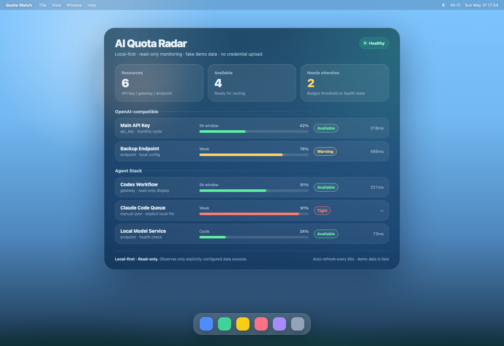

# Quota Watch

> A local-first dashboard for monitoring AI API quota, usage, and provider health across a personal or small-team agent stack.

Credentials stay local. Read-only. Runs with zero config on fake demo data.

[中文说明](README.zh-CN.md)

## Why

If you run several AI keys, gateways, or local model endpoints across a few tools and agents, it's easy to lose track of which one is near a budget threshold or quietly unreachable. Quota Watch gives you a single local **usage radar** — provider health and budget awareness at a glance — without sending anything to the cloud.

It is intentionally small and safe: **read-only monitoring** of endpoints *you* configure. See [Safety Boundary](#safety-boundary).

## Quickstart (≈5 minutes)

```bash
# Node 20+ recommended
npm install
npm run demo      # runs on built-in fake data, no keys needed
# open http://localhost:4319
```

That's it — you'll see a dashboard of fake resources with statuses, usage bars, and latency.

To use your own data:

```bash
cp .env.example .env     # then edit .env (it is gitignored)
# QW_SOURCE=manual  + QW_MANUAL_FILE=./my-usage.json
# or QW_SOURCE=openai-health + QW_OPENAI_BASE_URL=... + QW_OPENAI_API_KEY=...
npm run dev
```

Other scripts: `npm run build` (typecheck + compile to `dist/`), `npm test` (adapter tests).

## Demo screenshot



Run `npm run demo` and open `http://localhost:4319`. The dashboard renders the fake `examples/demo-quotas.json`, so any screenshot you take contains **no real data**.

Raw dashboard screenshot: [`docs/images/demo-dashboard.png`](docs/images/demo-dashboard.png). Browser-window mockup: [`docs/images/demo-desktop.png`](docs/images/demo-desktop.png).

## Safety Boundary

This tool is local-first and read-only — it only *observes*:

- it never reads OAuth credentials, auth files, CLI login state, or browser session files;
- it changes nothing about how you authenticate to, or connect with, any provider;
- it is **not in the request path** — it does not forward or relay model traffic;
- it uploads nothing — everything stays on your machine.

Adapters get data only from inputs you explicitly provide (a local file, or an endpoint + key passed via environment variables). The `manual-json` adapter reads **exactly the one JSON file** you point it to via `QW_MANUAL_FILE` — nothing else. Full details: [`docs/safety-boundary.md`](docs/safety-boundary.md).

## What this is NOT

- ❌ Not a hosted service — no server-side component, no telemetry, nothing leaves your machine.
- ❌ Not in your request path — it does not forward or relay model traffic.
- ❌ Not a credential or access manager — it never changes how you authenticate to a provider.
- ✅ It is purely an **observability panel**: it reads status and shows it. It takes no action.

## Adapter interface

An adapter is a small object that returns a list of resources:

```ts
export interface QuotaResource {
  id: string;
  provider: string;
  displayName: string;
  kind: string;                 // api_key | gateway | endpoint | manual ...
  status: 'available' | 'warning' | 'exhausted' | 'error' | 'unknown';
  shortWindowPercent?: number;  // e.g. last 5h
  weekPercent?: number;         // weekly usage
  cyclePercent?: number;        // monthly/custom billing cycle
  latencyMs?: number;
  resetAt?: string;
  updatedAt?: string;
  note?: string;
}

export interface Adapter {
  name: string;
  describe: string;
  fetch(ctx: { env: NodeJS.ProcessEnv }): Promise<QuotaResource[]>;
}
```

Built-in adapters: `demo-json`, `manual-json`, `openai-compatible-health`. Select them with `QW_SOURCE` (comma-separated). Add your own by dropping a file in `src/adapters/` and registering it in `src/adapters/index.ts`.

## Roadmap

- LiteLLM metrics adapter
- Expanded OpenAI-compatible `/v1/models` health checks
- SQLite history + trend charts
- Prometheus export
- Local alert webhook (Slack / Feishu)
- Adapter SDK
- Docker image
- Menubar / tray mini window

## License

MIT
