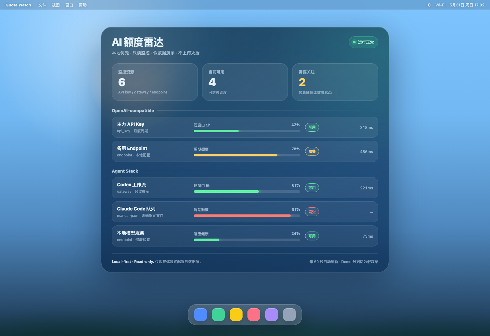

# Quota Watch 中文说明

> 一个本地优先的 AI 额度、用量和模型可用性监控面板，适合个人或小团队的 agent / gateway / API key 栈。

**本项目只做只读观察，不做请求转发、不做账号池、不做自动换号、不绕过平台限制。**

## 适合谁用

如果你同时在用多个 AI provider、OpenAI-compatible endpoint、内部 gateway、个人 key 或小团队共享的模型入口，常见问题是：

- 不知道哪个 endpoint 快到预算阈值；
- 不知道某个 provider 是否已经不可达；
- 多个 agent / 工具分散使用，缺少统一状态面板；
- 想要一个本地 dashboard，但不想把 key、usage 或业务数据上传到第三方服务。

Quota Watch 的定位就是：**本地 usage radar / observability panel**。

## 快速开始

```bash
# 推荐 Node 20+
npm install
npm run demo
# 打开 http://localhost:4319
```

默认使用内置假数据，无需任何 API key。

## Demo 截图



下图是基于 `npm run demo` 内置假数据制作的半透明桌面组件演示，不包含真实账号、真实额度或真实 provider 数据。

原始 dashboard 截图：[`docs/images/demo-dashboard.png`](docs/images/demo-dashboard.png)。

英文窗口版桌面图：[`docs/images/demo-desktop.png`](docs/images/demo-desktop.png)。

## 使用自己的数据

复制环境变量模板：

```bash
cp .env.example .env
```

### 方式一：manual-json

适合把你自己的导出数据转成 JSON 后本地展示：

```bash
QW_SOURCE=manual
QW_MANUAL_FILE=./my-usage.json
npm run dev
```

注意：`manual-json` 只读取 `QW_MANUAL_FILE` 明确指定的那个 JSON 文件，不会扫描目录，也不会读取登录态。

### 方式二：openai-compatible-health

适合只检查 OpenAI-compatible endpoint 是否可达：

```bash
QW_SOURCE=openai-health
QW_OPENAI_BASE_URL=https://your-endpoint.example.com
QW_OPENAI_API_KEY=replace-with-your-own-key
npm run dev
```

当前只调用：

```text
GET /v1/models
```

它只返回 reachability / latency / status，不解析真实 usage。

## 安全边界

Quota Watch 是 local-first + read-only：

- 不读取 OAuth credential；
- 不读取 auth 文件；
- 不读取 CLI login state；
- 不读取浏览器 session/cookie；
- 不上传数据；
- 不转发模型请求；
- 不在你的 model request path 中；
- 不管理账号池；
- 不自动换号；
- 不绕过额度或平台限制。

详细说明见：[`docs/safety-boundary.md`](docs/safety-boundary.md)。

## 内置 adapter

- `demo-json`：零配置假数据，用于演示和截图；
- `manual-json`：读取用户明确指定的本地 JSON 文件；
- `openai-compatible-health`：通过 `/v1/models` 做健康检查。

## 常用命令

```bash
npm run demo    # 使用假数据启动 dashboard
npm run dev     # 开发模式
npm test        # adapter 测试
npm run build   # TypeScript 编译
npm start       # 运行 dist/server.js
```

## 这个项目不是什么

- 不是 hosted SaaS；
- 不是 gateway；
- 不是请求代理；
- 不是 credential manager；
- 不是账号池；
- 不是额度绕过工具。

它只是一个本地可运行的 AI quota / usage / health 可视化面板。

## Roadmap

- LiteLLM metrics adapter；
- 更完整的 OpenAI-compatible health check；
- SQLite history + trend charts；
- Prometheus export；
- 本地 webhook alert；
- Adapter SDK；
- Docker image；
- Menubar / tray mini window。

## License

MIT
